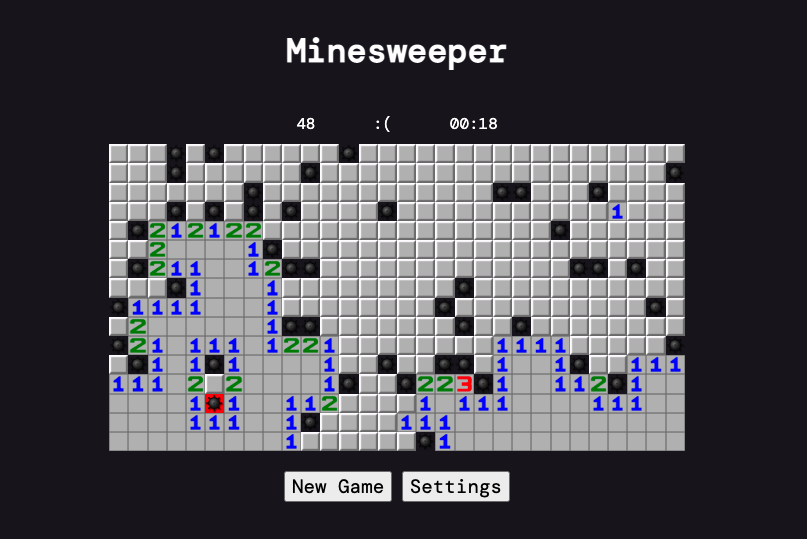

# MineSweeper

## Introduction
Based off the famous game MineSweeper, MonkeySweeper is essentially the same thing but with more settings. You can customize settings such as board width, height, difficulty, and style. There's not much difference except this would be almost an exact copy of the original.
<<<<<<< HEAD
## Languages Used
Javascript (Vanilla), CSS, HTML. Focused mostly on Javascript DOM Elements and functions as well as utilized classes.
Highlights
1. Bomb spread recursion function that allowed this game to have the 'spread' effect.
2. First time using Windows.localStorage
Key Learning Points
1. Have a better idea of what kind of data structure required (array, dictionary, etc)
2. Utilize pseudocode when creating different classes, functions, data structures, algorithms. Don't just dive in to the project.

=======

## Languages Used
Javascript (Vanilla), CSS, HTML. Focused mostly on Javascript DOM Elements and functions as well as utilized classes.
Highlights
1. Bomb spread recursion function that allowed this game to have the 'spread' effect.
2. First time using Windows.localStorage
Key Learning Points
1. Have a better idea of what kind of data structure required (array, dictionary, etc)
2. Utilize pseudocode when creating different classes, functions, data structures, algorithms. Don't just dive in to the project.

## Gameplay Images

